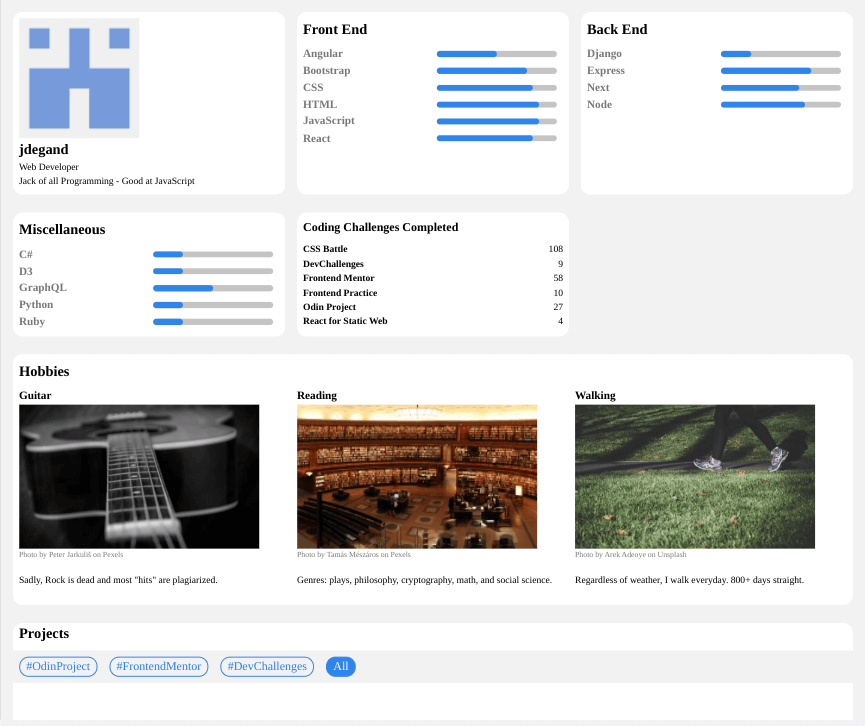
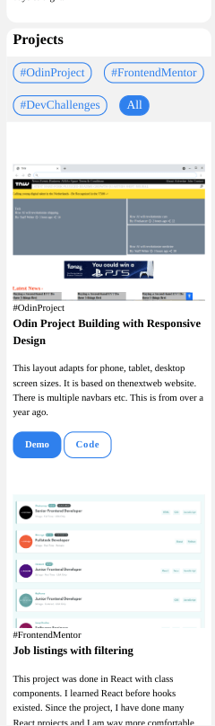

<h1 align="center">Portfolio</h1>

   Solution for a challenge from  <a href="http://devchallenges.io" target="_blank">Devchallenges.io</a>.

  <h3>
    <a href="https://jdegand.github.io/devchallenges-portfolio">
      Live Link
    </a>
     | 
    <a href="https://devchallenges.io/challenges/5ZnOYsSXM24JWnCsNFlt">
      Challenge
    </a>
  </h3>

## Table of Contents

- [Overview](#overview)
  - [Built With](#built-with)
- [Features](#features)
- [Requirements](#requirements)
- [Useful Resources](#useful-resources)

## Overview

- I used example 2 as my guide.

- I have resisted creating a portfolio for a while now.  Portfolios / Personal Websites can become a timesink that you are *never* satified with.  

- I tried using a progress tag and a label for skill bar.  WAVE tool complains about orphaned label - even when label is linked to id of progress bar.  Apparently, if a label is used not inside a form, this warning is thrown.  

- I have looked into the Github API and may try another porfolio project that incorporates it.  

- I have put down Python, C# and Ruby for a while and need to revisit them in the future.  

- I looked at some of my past projects and found some dead links etc so I need to do a little maintenance of my repos.

### Built With

- HTML
- CSS
- JS

## Features

This application/site was created as a submission to a [DevChallenges](https://devchallenges.io/challenges) challenge. The [challenge](https://devchallenges.io/challenges/5ZnOYsSXM24JWnCsNFlt) was to build an application to complete the given user stories.

## Requirements 

- [x] I can see personal details
- [x] I can see skills
- [x] I can see projects
- [x] I can filter projects by tag
- [x] I can see hobbies or certificates

Optional
- [ ] I can see experiences
- [ ] I can see blogs
- [ ] I can see projects on different pages

## Useful Resources

- [Steps to replicate a design with only HTML and CSS](https://devchallenges-blogs.web.app/how-to-replicate-design/)
- [Dev.to](https://dev.to/10xlearner/how-to-get-the-profile-picture-of-a-github-account-1d82) - get profile pic of github account
- [Bashooka](https://bashooka.com/coding/25-amazing-css-range-slider-designs/) - range slider designs
- [CSS Tricks](https://css-tricks.com/css3-progress-bars/) - progress bars
- [Codepen](https://codepen.io/vskand/pen/MWKKKYK) - vanilla js filtering example
- [Stack Overflow](https://stackoverflow.com/questions/2906582/how-to-create-an-html-button-that-acts-like-a-link) - html button that acts like a link
- [Stack Overflow](https://stackoverflow.com/questions/42290719/custom-styling-progress-bar-in-css) - styling progress element